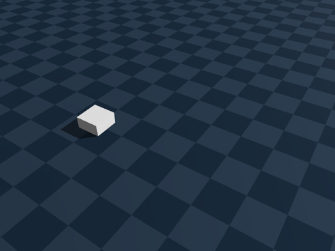

# genesis-nav

ROS 2-native embodied runtime for [Genesis World](https://github.com/Genesis-Embodied-AI/Genesis).

Run YAML scenarios, record evidence, mirror to ROS 2, replay later.



## Quickstart

```bash
python3 -m venv .venv && source .venv/bin/activate
pip install -e ".[dev]"

gnav doctor
gnav run examples/scenarios/smoke.yaml --fast
gnav bench --run benchmarks/nav_basic
```

Each run writes `runs/<id>/` with `events.jsonl`, `metrics.json`, `env.json`, and `report.md`.

**Rosbag** — record during the run, or export later:

```bash
# live (needs sourced ROS + genesis_nav_msgs)
gnav run examples/scenarios/smoke.yaml --fast --ros --record

# after the fact: re-simulate and write run_dir/rosbag/
gnav replay runs/<id> --to-rosbag
```

`--record` without `--ros` leaves `runs/<id>/rosbag/RECORDING_SKIPPED`; `--to-rosbag` replaces it with a real bag. See [`docs/replay.md`](docs/replay.md).

**Genesis** (optional):

```bash
gnav run examples/scenarios/smoke.yaml --fast --backend genesis
```

## What this is

- Scenario runner + grid/straight planners + ROS 2 bridge
- Replay, rosbag export (`gnav replay --to-rosbag`), and benchmark harness
- Safety boundary: actuator commands go through `CommandGate`

Not a Nav2 clone, RL framework, or VLA stack. See [`docs/architecture.md`](docs/architecture.md).

## Docs

| | |
|---|---|
| Interfaces | [`docs/interfaces.md`](docs/interfaces.md) |
| Benchmarks | [`docs/benchmarks.md`](docs/benchmarks.md) |
| Replay / rosbag | [`docs/replay.md`](docs/replay.md) |
| Roadmap | [`docs/roadmap_v02.md`](docs/roadmap_v02.md) |
| Contributing | [`CONTRIBUTING.md`](CONTRIBUTING.md) · [`docs/good_first_issues.md`](docs/good_first_issues.md) |

## Tests

```bash
PYTEST_DISABLE_PLUGIN_AUTOLOAD=1 python3 -m pytest tests/unit
```
