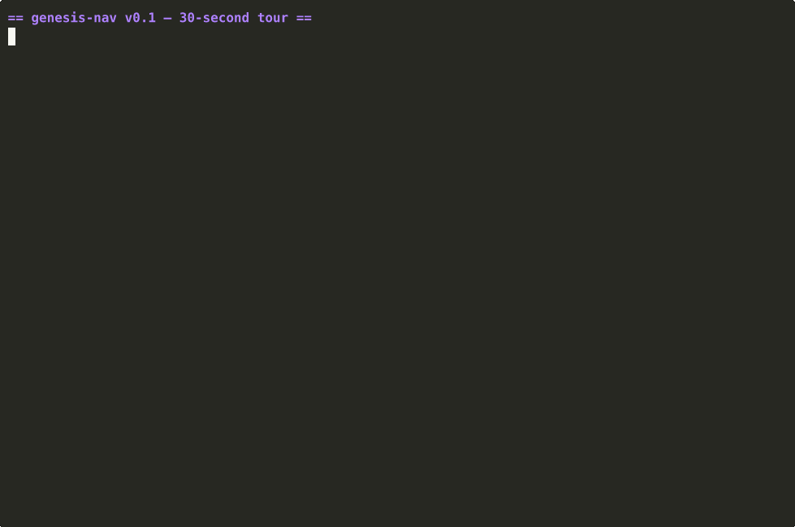

# genesis-nav

ROS 2-native embodied navigation and runtime infrastructure for Genesis World.

Embodied AI has policies. Robots need runtime.

`genesis-nav` is a runtime substrate for embodied navigation, multi-agent and
fleet simulation, replay, observability, and future real-robot deployment on
Genesis World. Genesis is the primary simulator. ROS 2 is the public contract.

## What works in 30 seconds



```bash
gnav run examples/scenarios/smoke.yaml --fast --record
```

- A diff-drive agent plans a path, navigates, and reports success.
- A run directory under `runs/` is written with `events.jsonl`,
  `metrics.json`, `env.json`, and `report.md`.
- Pass `--ros` to mirror the same run to ROS 2 topics (`/clock`,
  `/genesis_nav/events`, per-agent `/state` and `/odom`, tf).
- `gnav bench --run benchmarks/nav_basic` runs the same harness as a
  pass/fail benchmark.

The GIF above is regenerated by `make demo-gif` (requires `asciinema` and
`agg`). See `docs/demo_script.md` for the recording contract.

## Why genesis-nav?

Robotics demos often stop at "a policy moved a robot in simulation." Real
robotics work needs repeatable scenarios, stable interfaces, recorded evidence,
runtime state, fleet coordination, safety gates, and a path to ROS 2 deployment.

`genesis-nav` fills the layer between policy research and robot operations:

```text
Policy / VLA / RL / world model
        |
Embodied runtime infrastructure   <- genesis-nav
        |
ROS 2 / real robot / fleet / replay / telemetry
```

## What it does

- Genesis simulation runtime
- ROS 2 bridge contracts
- Multi-agent navigation scenarios
- Fleet task dispatch foundations
- rosbag and event-log oriented replay
- Runtime observability and metrics
- Humanoid-ready navigation interfaces
- AI-agent task API boundaries

## What it is not

- Not a Nav2 clone
- Not an RL framework
- Not a VLA framework
- Not a demo-only simulator wrapper
- Not a generic simulator abstraction layer
- Not a humanoid whole-body controller. The humanoid type is a
  navigation-intent shell; gait, balance, and footstep planning are out of
  scope for v0.1. See `docs/humanoid.md`.

## Quickstart

This repository currently boots the v0.1 runtime skeleton. It can validate and
run a smoke scenario without requiring Genesis or ROS 2 to be installed.

```bash
python3 -m venv .venv
source .venv/bin/activate
python3 -m pip install -e ".[dev]"
gnav doctor
gnav run examples/scenarios/smoke.yaml --fast --record
PYTEST_DISABLE_PLUGIN_AUTOLOAD=1 python3 -m pytest tests/unit
```

The run command writes a reproducible run directory under `runs/` containing the
scenario copy, resolved config, `events.jsonl`, `metrics.json`, `env.json`,
and `report.md`. Benchmark suites live under `benchmarks/<category>/` and run
through the same harness:

```bash
gnav bench --run benchmarks/nav_basic
```

See `docs/benchmarks.md` for the predicate vocabulary and report shape.

## Architecture

The repository is intentionally split into a Python runtime and ROS 2 packages:

- `genesis_nav/`: Python runtime library
- `genesis_nav/core/`: agent registry, task model, runtime clock, command gate
- `genesis_nav/genesis/`: thin Genesis adapter boundary
- `genesis_nav/ros/`: ROS 2 bridge boundary and QoS helpers
- `genesis_nav/fleet/`: task and resource coordination
- `genesis_nav/observability/`: events, metrics, run artifacts
- `ros2_ws/src/`: ROS 2 message, bridge, bringup, and example packages
- `examples/scenarios/`: reproducible scenario entry points

Public interfaces are documented in `docs/interfaces.md`. If a ROS topic,
message, action, service, runtime event, task schema, or scenario schema changes,
that document must be updated in the same change.

## Roadmap

`v0.1` targets a Genesis-hosted fleet runtime where a user can run one command,
watch multiple robots navigate, inspect ROS 2 topics, record a rosbag, replay the
run, and inspect metrics.

See `PLAN.md` for the detailed implementation plan and `docs/roadmap.md` for
the short staged roadmap.

## How it compares

| | Nav2 | Isaac Lab | Gazebo / Ignition | Genesis (raw) | **genesis-nav** |
|---|---|---|---|---|---|
| ROS 2-native runtime | yes | partial (bridge) | yes (bridge) | no | **yes (first-class)** |
| Multi-agent scenario harness | external | RL-focused | external | manual | **YAML + dispatcher** |
| Replayable run artifacts | partial (rosbag) | episode buffers | rosbag | none | **events.jsonl + rosbag + report.md** |
| Benchmark predicates as code | no | RL metrics | no | no | **`gnav bench` + expectations.yaml** |
| AI-tool safety boundary | n/a | n/a | n/a | n/a | **`CommandGate` + `AgentToolApi`** |
| Real-robot deployment path | yes | indirect | indirect | no | **planned via ROS 2 contract** |

`genesis-nav` is not a replacement for Nav2's mature plugin ecosystem or
Isaac Lab's RL stack. It is the runtime layer that lets you exercise a
policy, a scenario, and a real-robot contract from the same YAML and the
same `events.jsonl`.

## Contributing

The project favors working runtime paths over broad abstraction. Start with
scenario, benchmark, ROS 2 interface, Genesis adapter, observability, or docs
issues.

- [`CONTRIBUTING.md`](CONTRIBUTING.md) — setup, tests, PR expectations,
  safety boundary.
- [`docs/contributing_scenarios.md`](docs/contributing_scenarios.md) —
  how to add a scenario or benchmark.
- [`docs/good_first_issues.md`](docs/good_first_issues.md) — ten curated
  starting points.
- [`docs/decisions.md`](docs/decisions.md) — read before any architectural
  change.
