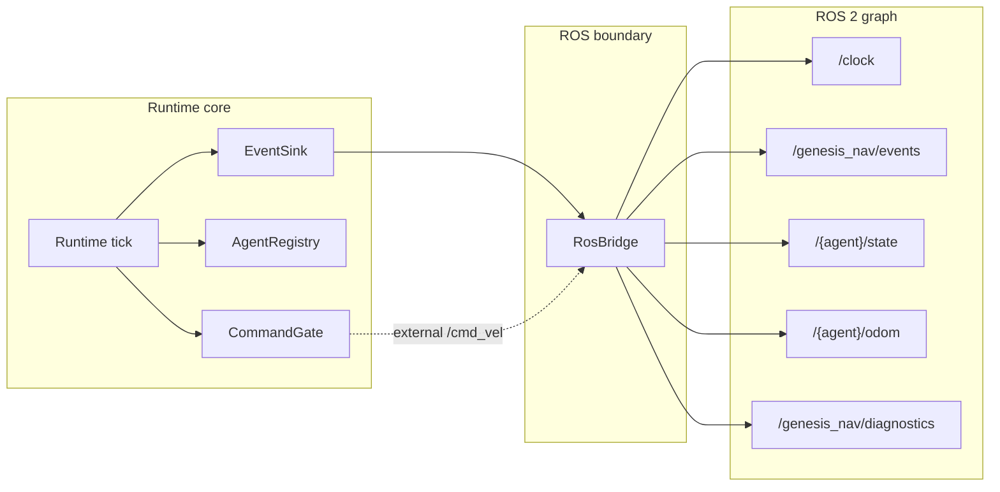
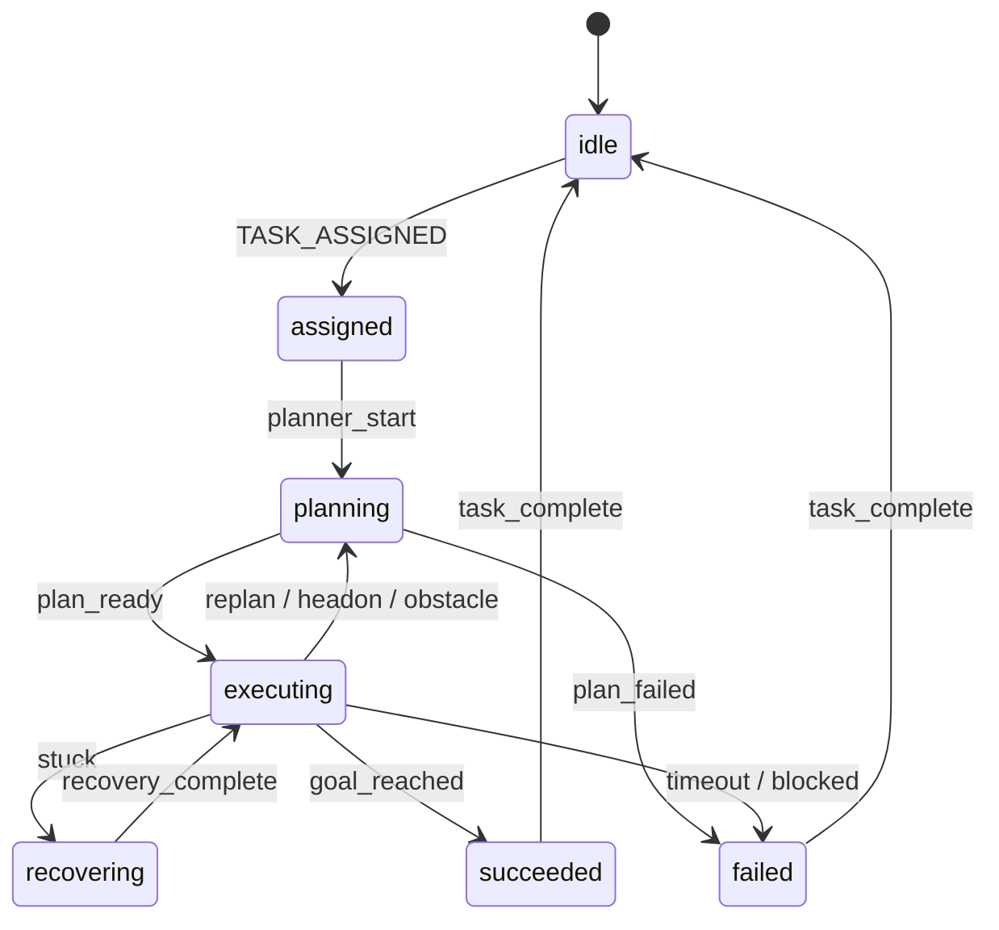
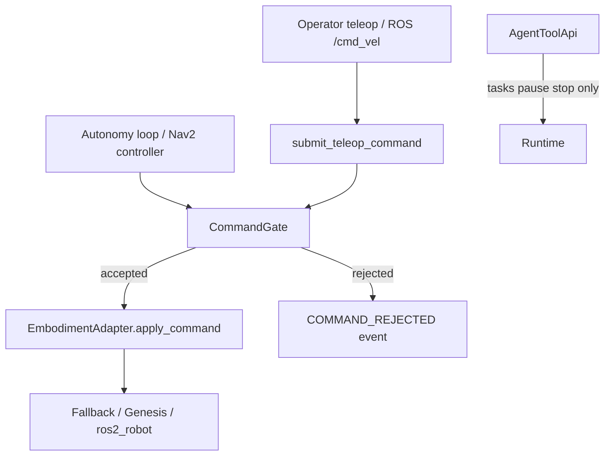

# Architecture

## Positioning

`genesis-nav` is not a navigation algorithm library. It is the embodied runtime
control plane between policies, planners, simulators, ROS 2, replay artifacts,
fleet tasks, and future real robots.

## Runtime → ROS 2 fanout

## Task lifecycle

## Command authority chain

## Core Split

Control plane:

- task assignment
- fleet state
- resource leases
- runtime mode
- safety authority
- scenario control

Data plane:

- odometry
- tf
- sensor data
- velocity commands
- images
- point clouds

## Runtime Components

- `AgentRegistry`: source of truth for agent identity, namespace, frames, and
  capabilities.
- `CommandGate`: authority arbitration, velocity limits, stale-command
  rejection, emergency stop handling.
- `TaskDispatcher`: assigns task specs to agents.
- `ReservationManager`: lease-based resource locking.
- `EventBus`: structured runtime events for replay and debugging.
- `SafetySupervisor`: stops agents, pauses simulation, and rejects unsafe
  commands.

## Adapter Rule

Genesis-specific API usage belongs under `genesis_nav/genesis/`. Runtime core
must be unit-testable without Genesis installed.

ROS 2-specific code belongs under `genesis_nav/ros/` and `ros2_ws/src/`.
Public ROS 2 contracts are documented in `docs/interfaces.md`.
